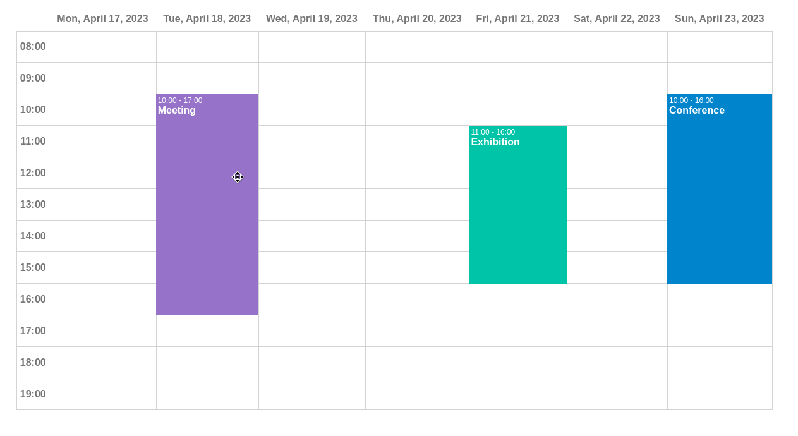

# @mormat/react-scheduler

React UI component for rendering a scheduler



- [Demo](https://mormat.github.io/react-scheduler/)

## Installing

```
npm install @mormat/react-scheduler
```

## Basic example

```js
import Scheduler from "@mormat/react-scheduler";

function App() {
    
    const config = {
        events: [
            {
                start: Date.now(),
                label: "some event",
            }
        ]
    }
    
    return <Scheduler { ...config } />;
    
}

export default App;
```

## API
Available props for this component are :
* `events`: an array of objects representing the events to display in the scheduler. Each object must contain the properties below :
    - `label`: a string containing the description of the event
    - `date`:  date of the event (string format YYYY-MM-DD)
    - `startTime`:  starting time of the event (string format HH:MM)
    - `startTime`:  ending time of the event (string format HH:MM)
* `initialDate`: if specified, the scheduler will start at this date (string format YYYY-MM-DD)
* `minHour`: the minimum hour in the Y-axis (string format HH:MM)
* `maxHour`: the maximum hour in the Y-axis (string format HH:MM)
* `locale`: specify which i18n locale to use when formatting dates in the header (for instance 'en-US', 'fr-FR', etc.). It's the same locale string used by the javascript class [Intl.DateTimeFormat](https://developer.mozilla.org/fr/docs/Web/JavaScript/Reference/Global_Objects/Intl/DateTimeFormat/DateTimeFormat)
* `draggable`: if sets to true, enable drag and drop on scheduler events (default is true)
* `rowHeight`: sets the height of a row (integer or a string like '50px')

