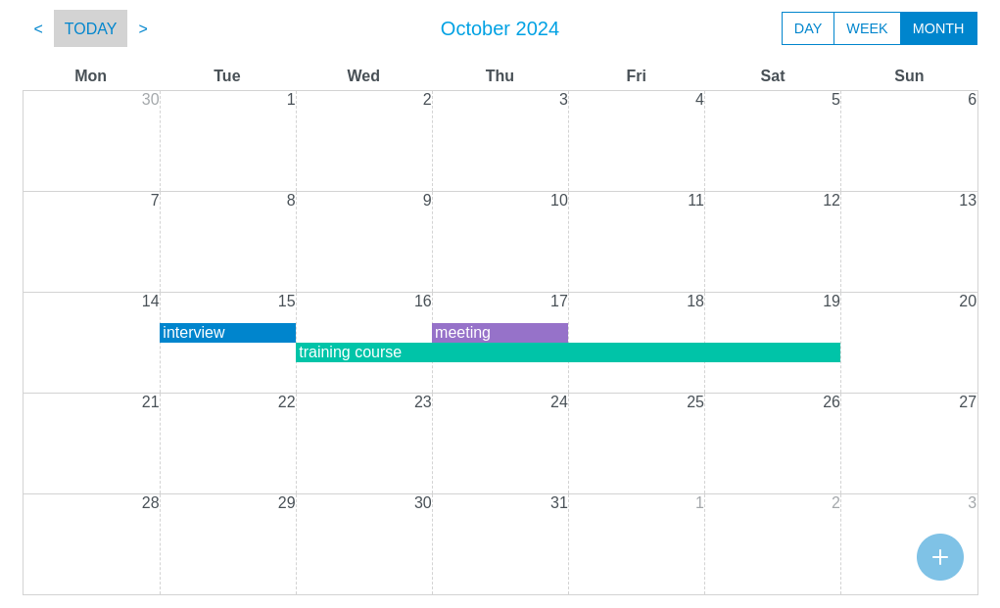

# @mormat/react-scheduler 

React scheduler component ([demo](https://mormat.github.io/react-scheduler/))

week view                 | month view
:-------------------------:|:-------------------------:
 | 

A [standalone version](#using-the-standalone-version) that can be installed in any HTML page without installing React is also available. 

## Available features
- switch between views `day`, `week` or `month`
- events can be loaded [statically](#loading-static-events) (from an array) or [dynamically](#loading-dynamic-events) (from an ajax request for instance)
- drag and drop events
- create/update/delete events
- few dependencies : only `React` (>= 17.0.0) and `ReactDOM` (>= 17.0.0) are required. The standalone version requires no dependencies at all.


## Usage in a React project

### Installing

```
npm install @mormat/react-scheduler
```

### Loading static events

```js
import Scheduler from "@mormat/react-scheduler";

function App() {
    
    const events = [
        {
            label: "Meeting",
            start: "2024-02-28 10:00",
            end:   "2024-02-28 12:00",
        }
    ];

    return (
        <Scheduler 
            events      = { events } 
            initialDate = "2024-02-28"
        />
    );
    
}
```

### Loading dynamic events

@todo write other examples

## Using the component in an ordinary HTML page

1. First, you need to add the React and ReactDOM libraries in your HTML page
```html
    <script src="//unpkg.com/react@18/umd/react.development.js"></script>
    <script src="//unpkg.com/react-dom@18/umd/react-dom.development.js"></script>
```

2. Download [mormat_react_scheduler.js](https://github.com/mormat/react-scheduler/releases/latest) in the release page then add it to your HTML page.
```html
    <script src="./mormat_react_scheduler.js"></script>
```

3. Then add the lines below to render the scheduler
```html
    <div id="scheduler"></div>
    <script>
        var props = { 
            /* the same props used in a React project */ 
        };

        var container    = document.getElementById('scheduler');
        var reactElement = React.createElement(
            mormat_react_scheduler.Scheduler, 
            props
        );

        // with React v17
        ReactDOM.render(reactElement, container)

        // with React v18
        var root = ReactDOM.createRoot(container);
        root.render(reactElement);

    </script>
```

The available `props` can be found in [src/types.ts](src/types.ts)

## Using the standalone version

1. Download [mormat_standalone_scheduler.js](https://github.com/mormat/react-scheduler/releases/latest) in the release page then add it to your HTML page.
```html
    <script src="./mormat_standalone_scheduler.js"></script>
```

2. Then add the lines below to render the scheduler
```html
    <div id="scheduler"></div>
    <script>
        var props = { 
            /* the same props used in a React project */ 
        };

        mormat_standalone_scheduler.renderScheduler('#scheduler', props);
    </script>
```

The available `props` can be found in [src/types.ts](src/types.ts)

### Examples
#### Loading static events

```html
    <div id="scheduler"></div>
    <script>
        var props = { 
            initialDate: '2024-02-01',
            events: [
                {
                    label: 'Meeting',
                    start: '2024-02-01 10:00',
                    end:   '2024-02-01 12:00',
                },
                {
                    label: 'Conference',
                    start: '2024-02-01 14:00',
                    end:   '2024-02-01 18:00',
                },
            ]
        };

        mormat_standalone_scheduler.renderScheduler('#scheduler', props);
    </script>
```    

@todo write other examples

## How it works


Inline CSS are used for styling. To avoid conflicts, all classNames are prefixed with `mormat-scheduler-*`